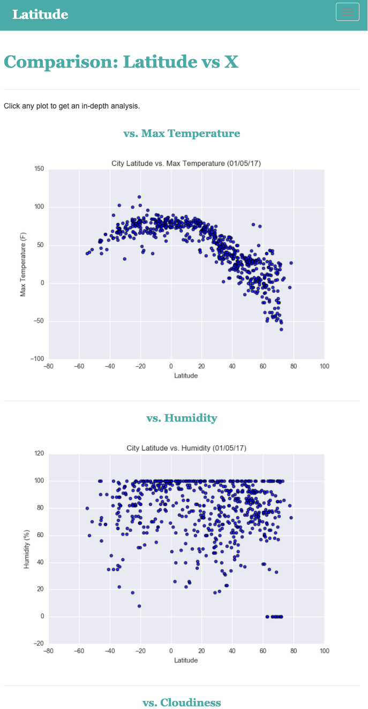

# Web-Design-Challenge
## Web Visualization Dashboard (Latitude)

Find the completed Latitude Web Visualization here: [Web Visualization](https://sarakim-sy.github.io/web-design-challenge)

## Background

Data is more powerful when we share it with others! This project is to create a dashbaord showing the analysis using HTML, CSS, and Bootstrap.

## Latitude - Latitude Analysis Dashboard with Attitude

For this homework we'll be creating a visualization dashboard website using visualizations we've created in a past assignment. Specifically, we'll be plotting [weather data](Resources/cities.csv).

In building this dashboard, we'll create individual pages for each plot and a means by which we can navigate between them. These pages will contain the visualizations and their corresponding explanations. We'll also have a landing page, a page where we can see a comparison of all of the plots, and another page where we can view the data used to build them.

### About the website

For reference, see the ["Screenshots" section](#screenshots) below.

The website consists of 7 pages total, including:

* A [landing page](#landing-page) containing:
  * An explanation of the project.
  * Links to each visualizations page. There should be a sidebar containing preview images of each plot, and clicking an image should take the user to that visualization.
* Four [visualization pages](#visualization-pages), each with:
  * A descriptive title and heading tag.
  * The plot/visualization itself for the selected comparison.
  * A paragraph describing the plot and its significance.
* A ["Comparisons" page](#comparisons-page) that:
  * Contains all of the visualizations on the same page so we can easily visually compare them.
  * Uses a Bootstrap grid for the visualizations.
    * The grid is two visualizations across on screens medium and larger, and 1 across on extra-small and small screens.
* A ["Data" page](#data-page) that:
  * Displays a responsive table containing the data used in the visualizations.
    * The table is a bootstrap table component.
    * The data come from `.csv` file which was converted to HTML using Pandas `to_html` method that allows you to generate a HTML table from a pandas dataframe. See the documentation [here](https://pandas.pydata.org/pandas-docs/version/0.17.0/generated/pandas.DataFrame.to_html.html)

* The website, at the top of every page, has a navigation menu that:

  * Has the name of the site on the left of the nav which allows users to return to the landing page from any page.
  * Contains a dropdown menu on the right of the navbar named "Plots" that provides a link to each individual visualization page.
  * Provides two more text links on the right: "Comparisons," which links to the comparisons page, and "Data," which links to the data page.
  * Is responsive. 
  
* Finally, the website was deployed to GitHub pages. [Web Visualization](https://sarakim-sy.github.io/web-design-challenge)

### Screenshots

This section contains screenshots of each page that must be built, at varying screen widths. These are a guide; you can meet the requirements without having the pages look exactly like the below images.

#### Landing page

Large screen:

Small screen:



#### Comparisons page

Large screen:

Small screen:

#### Data page

Large screen:

Small screen:

#### Visualization pages

There are four visualization pages, one for each visualization. Here's an example of one:

Large screen:

Small screen:

#### Navigation menu

Large screen:

Small screen:

